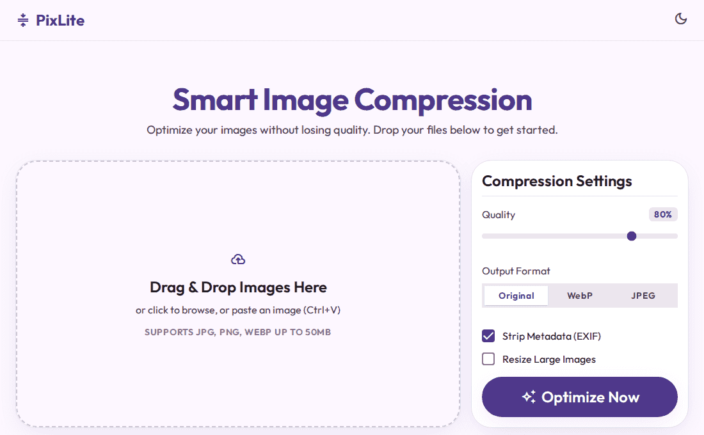
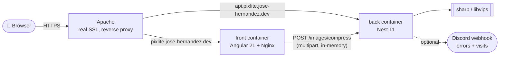

# PixLite

<p align="center">
  
</p>

<p align="center">
  <strong>Smart image compression, right in your browser.</strong><br/>
  Drop, paste, or select images — tune quality, format, and metadata — compare before/after, then download the results or a single .zip.
</p>

<p align="center">
  <a href="https://pixlite.jose-hernandez.dev">Live demo</a> ·
  <a href="#getting-started">Getting started</a> ·
  <a href="#architecture">Architecture</a>
</p>

<p align="center">
  
  
  
  
  
  
</p>

## Features

- 🖼️ **Drag & drop, click, or paste (Ctrl+V)** — three ways to add images, no friction.
- 🎛️ **Quality, format, metadata, resize** — WebP/JPEG/original output, strip EXIF or keep it, cap oversized photos at 2048px.
- 🔍 **Before/after comparison slider** — drag to reveal exactly what changed, per image.
- 📦 **Batch summary + one-click .zip** — total savings across the batch, download everything at once.
- 🌙 **Dark mode** — persisted across visits, respects your system preference the first time.
- 📲 **Installable PWA** — add it to your home screen; the app shell works offline once loaded.
- 🔒 **Rate-limited, stateless backend** — no accounts, no database; nothing is kept after the response.

## Live demo

**[pixlite.jose-hernandez.dev](https://pixlite.jose-hernandez.dev)**

## Getting started

```bash
# Backend (port 3000)
cd back && npm install && npm run start:dev

# Frontend (port 4200), in another terminal
cd front && npm install && npm start
```

Open `http://localhost:4200`.

### Tests

```bash
cd back && npm test && npm run test:e2e   # Jest unit + Supertest e2e
cd front && npm test                       # Vitest (components + services)
cd front && npm run e2e                    # Playwright, against a real backend
```

## Architecture



- **Stateless by design** — every request is compressed in memory and returned in the same response (`buffer → base64 → JSON`). No database, no disk writes, no accounts.
- **Front and back are two separate deployables** (Docker containers), not a monorepo build — CORS, not a dev proxy, connects them in every environment.
- Every endpoint that isn't the core `/images/compress` (visit pings, client-error reporting) shares the same per-IP rate limiter and never holds a secret in the browser bundle.
- The full history of *why* each architectural call was made — stack choice, client vs. server compression, testing strategy, bugs found and fixed — lives in [`DECISIONES.md`](./DECISIONES.md).

## Tech stack

| | |
|---|---|
| Frontend | Angular 21 (standalone, zoneless), Tailwind CSS v4, Vitest, Playwright |
| Backend | NestJS 11, `sharp` (libvips), Jest + Supertest |
| Deploy | Docker Compose behind Apache (SSL via certbot), auto-deployed by Coolify on every push to `main` |

## Project structure

```
pixlite/
├── front/    Angular 21 — src/app/{core,shared,pages}
├── back/     Nest 11 — src/{images,notifications,common}
└── docs/     demo.gif and other README assets
```

---

See [`DECISIONES.md`](./DECISIONES.md) for the full architecture decision log, and [`DEPLOY.md`](./DEPLOY.md) for the deployment setup.
